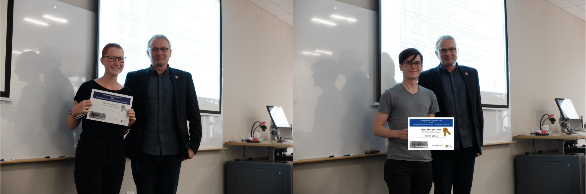

### [bioDS lab](/) in February 2023:

### [bioDS lab](/) in December 2019:

[Tom](/people/), [Jiří](/people/), [Lena](/people/), [Alex](/alex/), [Surayo](/people/), [Moizle](/people/), [Astra](/people/), [Kieran](/kieran/)

### Anna and Moizle are graduating:

### Lena and Kieran are served Best Presentation awards at Otago CS-IS postgrad symposium:

### Joint retreat [bioDS](/) and [Gardner Binf](http://www.gardner-binflab.org/) labs in Pounawea:

### [bioDS lab](/) in January 2019:

[Alex](/alex/), [Astra](/people/), [Lena](/people/), [Moizle](/people/), [Jiří](/people/), [Anna](/people/), [Tom](/people/), [Kieran](/kieran/)

### [Alex](/alex/) with [Mike Steel](http://www.math.canterbury.ac.nz/~m.steel/) at field work:

### At [Networks of Life 2015](http://www.math.canterbury.ac.nz/bio/events/kaikoura2015/) in Kaikoura:

### With Sally Sievers and [Anil Nerode](http://www.math.cornell.edu/~anil/):

